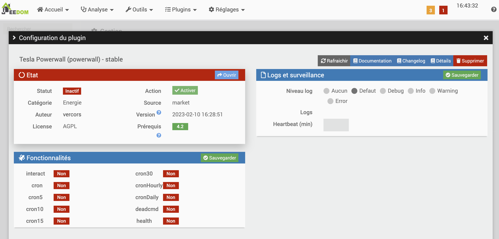
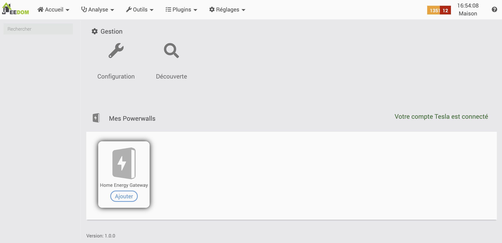
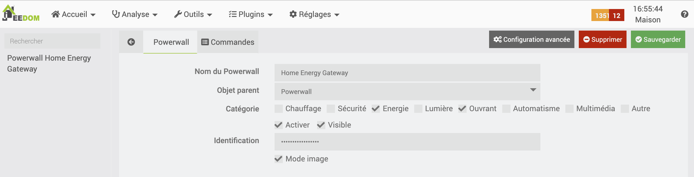

Introduction
===
Welcome to the documentation of the Powerwall Tesla plugin of Jeedom home assistant! 

Thanks to this plugin, a user can monitor her/his Powerwall Tesla and play with the data fetched from Tesla API.

Installation
== 
Once uploaded from the Jeedom market, the plugin is activated:

 

----

Then the authentication are set to have access to Powerwalls associated with the Tesla user account :

 

> Note
>
> When the Tesla plugin is installed and connected, te Powerwall plugin reuses the tokens for its onnection.

Configuration
== 
There are no dedicated configuration. Tokens can be displayed and manually refreshed. However, the plugin automatically refreshes them when needed.

The data are fetched every 5 or 30 minutes:
 - for a 5 minutes acquisition : uncheck `cron30` and check `cron5`
 - for a 30 minutes acquisition : uncheck `cron5` and check `cron30`

Add a Powerwall
==

The plugin configuration is available from menu:

`Plugin > Energy > Tesla Powerwall`

 

Once Tesla account is connected, user can display the Powerwalls ready to be added to Jeedom:

User clicks on `Add` to create the corresponding Jeedom equipment with its commands:

Powerwall configuration
==

To have access to the Powerwall configuration, user clicks on its icon:
 - `Name of Powerwall` : To rename it (Optional).
 - `Objet parent` : To associate it to a parent object.
 - `Activer` et `Visible` : To activate it and make it visible into parent object dashboard.
 - `Identification` : Its unique id number (readonly)
 - `Iage mode` : Tick this box to display a nice widget with synthetic view of the exchanges between the different elements: 
     - `HOME` : power used by appliances 
     - `SOLAR` : energy that comes from solar panels
     - `GRID` : energy sold or bought from/to the network
     - `POWERWALL` : the stored energy

 

Widget
==
The widget in its nice view (Image mode) displays a comprehensive view of the energy flows that transif thru the inverter:

 

All power values are by default historised. A clic on a power value displays a graph:

 

Commands
==

 

Enjoy !!

:) 