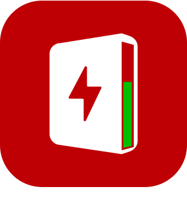
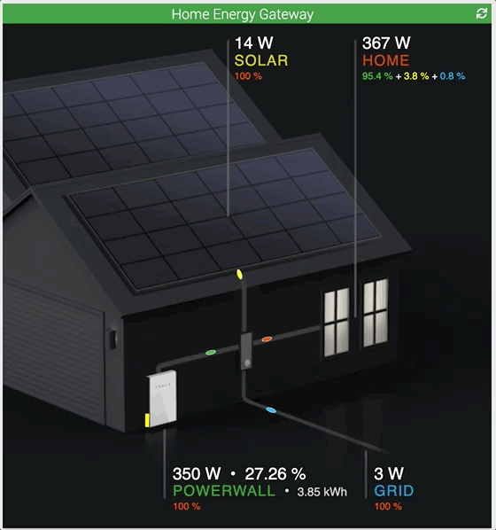

# 1.0.0 (2023-02-10)

 

**Ceci est la première version **stable** publiée sur le market de Jeedom**

- **HOME**: Affichage de la puissance instantanée de la consommation
- **SOLAR**: Affichage des données de production solaire
- **GRID**: Affichage des données de consommation et revente d'électricité au réseau
- **POWERWALL**: Affichage des données de charge et décharge de la batterie 
- Possibilité d'afficher un mode image qui permet d'avoir une vue synthétique des échanges entre les différents éléments
- le curseur à gauche du powerwall indique le niveau de la batterie:
  - en rouge si inférieur à 20%
  - en jaune si compris entre 20% et 40%
  - en vert si supérieur à 40%
- les pastilles de couleurs indiquent le sens des flux (charge/decharge et achat/vente)
- Indication de la répartition des flux : 
   - Par exemple au niveau des panneaux solaires (SOLAR), le widget affiche le pourcentage qui est utilisé pour charger le powerwall et le pourcentage qui est utilisé pour la consommation de la maison.
   - Coté consommation, le widget affiche précisément la répartition de l'origine de électrons (SOLAR, POWERWALL et GRID)  

- les données de puissance des différentes sources sont disponibles comme Info sur l'équipement
- Au choix, l'acquisition des données peut se faire toutes les 5 minutes ou toutes les 30 minutes (cron5 et cron30)

 

> Note
>
> Un grand merci à `Florent`, premier beta testeur, pour sa confiance.