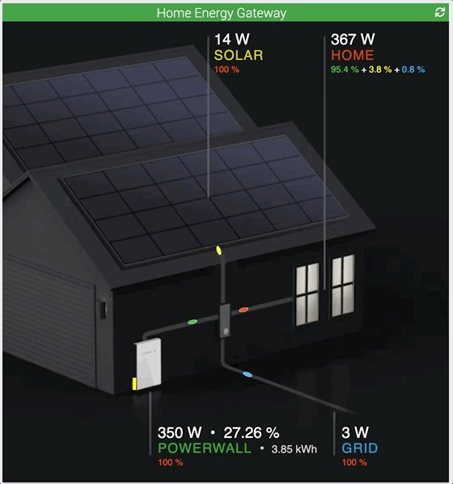

Introduction
===
Bienvenue sur la page de documentation du plugin Powerwall Tesla de Jeedom ! 

Avec ce plugin l'utilisateur peut accéder à son Powerwall Tesla et intéragir avec les données remontées par l'API proposée par Tesla.

Installation
== 
Après avoir téléchargé le plugin depuis le market, il faut l'activer en cliquant sur "Activer" :

 

----

Ensuite il faut indiquer les jetons d'authentification du compte Tesla pour accéder à la liste des Powerwalls qui y sont associés :

 

> Note
>
> Si le plugin Tesla est installé et connecté, le plugin Powerwall va réutiliser les mêmes tokens d'authentification

Configuration
== 
Il n'y a pas de configuration dédiée. Les tokens peuvent être affichés ou raffraichis manuellement. Le widget les raffraichis automatiquement avant qu'ils n'expirent.

Les données collectées le sont toutes les 5 minutes ou toutes les 30 minutes.
 - pour une collecte toute les 5 minutes : décocher `cron30` et cocher `cron5`
 - pour une collecte toute les 30 minutes : décocher `cron5` et cocher `cron30`

Ajouter un powerwall
==

La configuration du plugin Powerwall est accessible à partir du menu:

`Plugin > Energie > Tesla Powerwall`

 

Une fois connecté au compte Tesla, les Powerwalls non encore ajoutés dans Jeedom seront visibles après avoir cliqué sur `Découverte`. 

Pour créer l'équipement et les commandes associées, il faut cliquer sur `Ajouter` :

Configuration d'un powerwall
==

En cliquant sur l'icone du Powerwall, on accède à son panneau de configuration, où on trouve :
 - `Nom du Powerwall` : Pour le renommer éventuellement.
 - `Objet parent` : Pour l'associer à un objet parent.
 - `Activer` et `Visible` : Pour l'activer et le rendre visible sur le dashboard de son objet parent.
 - `Identification` : Son numéro d'identification du Powerwall (lecture seule)
 - `Mode image` : Case à cocher si on souhaite afficher un widget *image* qui propose une vue synthétique des échanges d'électrons entre les différents éléments de l'installation électrique : 
     - `HOME` : la puissance instantanée de la consommation (en Watt) de la maison 
     - `SOLAR` : les panneaux solaires et leur puissance de production (en Watt)
     - `GRID` : le réseau auquel on achète et/ou vend de l'électricité
     - `POWERWALL` : la batterie Tesla qui stocke l'énérgie produite et/ou achetée.

 

Widget
==
Le widget en mode image donne une idée très précise des différents flux d'electrons. Le sens de la pastille indique si la batterie se charge ou se décharge, si les panneaux solaires produises et si l'installation vend ou achète de l'éléctricité au réseau  

 

Par défaut les données des puissances collectées sont historisées. Un clic sur la valeur depuis le widget (mode image ou non) permet de visualiser les différents graphes :

 

Commandes
==

 

Enjoy !!

:) 